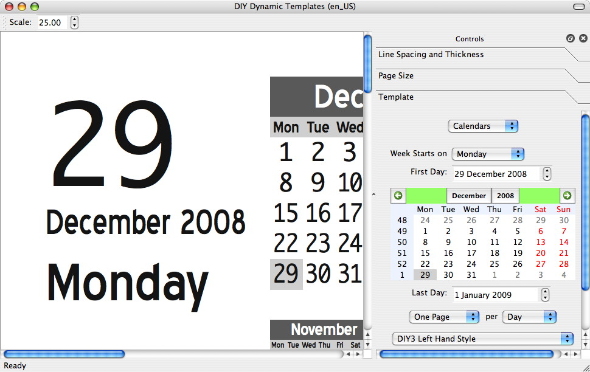

# DynamicTemplates

Old D.I.Y. Planner Dynamic Templates code, rescued from the Way Back Machine, tweaked to make day planner templates for me.

# History

The DIYPlanner.com website used to be a treasure trove of printable do-it-yourself planner pages.  This was back in the hey day of paper planners from Franklin-Covey, DayTimer, DayPlanner, Levenger, etc. etc.

From https://web.archive.org/web/20160313133043/http://diyplanner.com/:

> Welcome to DIYPlanner.com!

> We are a community of people who see the value of paper as a medium for planning, productivity, creative expression, and exploring ideas. We encourage visitors to share advice and inspiration, and we love to see submissions for templates, kit images and story articles. We are also the official home of the free D*I*Y Planner kits. Please enjoy your stay, and make yourself at home!

The last post on the main page is dated August 2015.  As of December 2020, the site http://diyplanner.com/ exists, but it's not the same; it looks like someone has bought the domain and is seeding it with old entries from the original site, but with newer dates.

The original site is still available on the Way Back Machine site, e.g., https://web.archive.org/web/20160313133043/http://diyplanner.com/.

The site included a Dynamic Template tool.  See https://web.archive.org/web/20160311043936/http://diyplanner.com/node/6210 for more discussion, but key points are:

> The D*I*Y Planner Dynamic Template application has now hit version 2.0, ready to produce any size and shape of yearly, monthly, weekly, and daily calendars for your printing pleasure. All designs are based upon the Classic versions of the D*I*Y Planner, along with input from Doug, and so will integrate completely into your DiyP setup. (The daily design was created by Doug, but was never implemented as a static template owing to the insane amount of repetitive work required.)

> Simply select your paper size, choose the calendar type, and tweak the settings to come up with your own printable set of calendars that perfectly fit your planner and your lifestyle.

> The Mac version was built in Mac OS 10.4.11, using Qt 4.5.2
> Here's a shot of the Mac version as it starts up:

The last update on the dynamic template pages is December 2009.

# My Story

I was big into paper planners and made use of the DIY Planner pages, including output from the dynamic template tool years ago.

I recently acquired a Remarkable2 tablet, which I want to turn into a digital 'paper' planner.  The planner pages from this site/tool would be perfect.  Except, the site is now part of the way back machine.

I was able to download the tool from https://web.archive.org/web/20160311043936/http://diyplanner.com/node/6210.

The tool requires the Blue Highway font, which I also downloaded.

Unfortunately, although the tool still works; there's an issue with the font on my Mac - the condensed font does not seem to work properly, and the text on the day page (e.g., December 2008 in the screenshot) was way too big.

Since the rest of the tool did what I wanted, and I couldn't figure out a way to hack the font, I decided to see if I could modify the source code to use a different font.

# Attempts

1. I was unable to find the exact right Blue HIghway font to make the tool look like it does in the screensho (on Mac).  Blocked.
2. I knew that the name of the font is embedded in the code.  I did not explore trying to change an existing font and renaming it - I should explore this, given below.
3. I was able to download the source code and finally get it running.  However, although I kept changing the font to other fonts on my Mac (all ttf), the font was always Helvetica.  I'm unfamiliar with QT and C++, but my research indicates I'm using the right commands to change font, even including the font itself as a resource.  Blocked.
4. For now, I decided to go with the default Helvetica and tweak the rest of the code to suit my needs, e.g., instead of printing "December", print "Dec", etc.  I also took the opportunity to rename various sections on the 2-page-per-day templates.

# Code

I'm using:

- The Dynamic Templates v2.05a source code downloaded from https://web.archive.org/web/20160311043936/http://diyplanner.com/node/6210
- QT Creator and open source version of QT, 
   - https://www.qt.io/download-open-source?hsCtaTracking=9f6a2170-a938-42df-a8e2-a9f0b1d6cdce%7C6cb0de4f-9bb5-4778-ab02-bfb62735f3e5
   - https://www.qt.io/download-qt-installer?hsCtaTracking=99d9dd4f-5681-48d2-b096-470725510d34%7C074ddad0-fdef-4e53-8aa8-5e8a876d6ab4
- QT4 version installedx with help from https://stackoverflow.com/questions/50442009/how-to-install-qt4-with-home-brew/50442031

With the QT Creator, and a project that deliberately targets QT4 (vs. the default 5), I'm able to compile the dynamic template app and get it running.

# This Repository

The code in this repository is the v2.05a dynamic template code mentioned above, plus any tweaks I needed to do to make it work for me in December 2020.  Plus tweaks to make the two-page-per-day template useful for me.  Plus some debugging code, since I'm not giving up on figuring out how to change the fonts.

Original source downloaded from: https://web.archive.org/web/20160311043936/http://diyplanner.com/node/6210

# License from Dynamic Planner Code

    // DIY_Dynamic_Templates_V2 is free software; you can redistribute it and/or modify
    // it under the terms of the GNU General Public License as published by
    // the Free Software Foundation; either version 3 of the License, or
    // (at your option) any later version.
    // 
    // DIY_Dynamic_Templates_V2 is distributed in the hope that it will be useful,
    // but WITHOUT ANY WARRANTY; without even the implied warranty of
    // MERCHANTABILITY or FITNESS FOR A PARTICULAR PURPOSE.  See the
    // GNU General Public License for more details.
    // 
    // Refer to the GNU General Public License in file "license.txt"
    // Otherwise, see <http://www.gnu.org/licenses/>.

